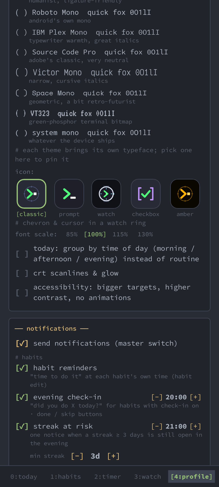
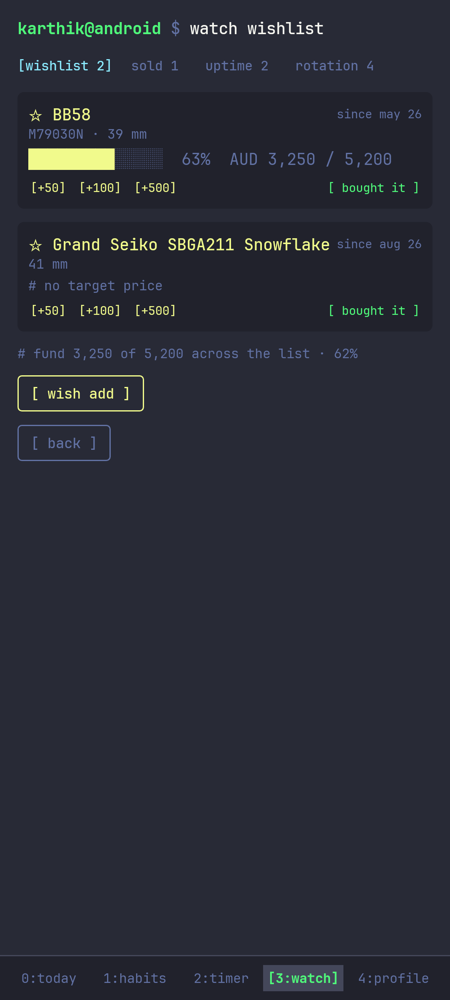
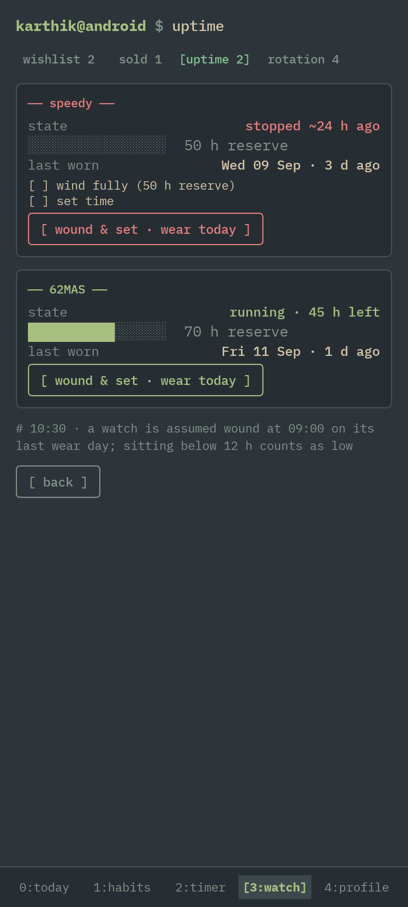

<p align="center"></p>
<h1 align="center">Personal Terminal</h1>
<p align="center"><code>user@android $ daily</code> — a terminal-styled habit tracker for Android.</p>

<p align="center"></p>

## What it does

- **Habits** — checkbox, counter (`5/8 cups`), timer, *checklist* (`pack gym bag` → shoes, towel, bottle…) and *avoid* modes (`no sugar`: clean days grow the streak, a slip breaks it); routines with daily / weekly / custom schedules, or Today grouped by time of day; weekly quotas that tell you `2/3 · last chance today`; *pause* a habit until a date (`pause run 2w`) and it comes back by itself; 22 templates; per-habit reminders plus an evening *check-in* ("did you do X today?" with done / skip buttons) or one *evening summary* line, streak-at-risk notices, an opt-in one-line *morning briefing*, a gentle *comeback nudge* after three quiet days, and quiet hours; skip-with-reason, completion notes and mood.
- **Habits that bend** — every counter / timer can have a *minimum version* (`min read 2`: two pages keep the streak as `[~] min`, half the XP), a *ramp* (`ramp read 30 8`: the target grows 20 → 30 one step a week), an *anchor* for habit stacking (`after journal read`: Today shows `read → journal`, greys the follower until the anchor is ticked and nudges you at that moment) and a *life area* (body / mind / work / people / home / money) that draws an ASCII balance radar in the weekly review.
- **Streaks, strength, shields & insurance** — next to every streak sits a *strength* score (a forgiving, Loop-style rolling rate: one miss costs ~7 points, one day back earns them; `strength` lists habits weakest first with a sparkline); forgot to log yesterday? Until noon `[ did it yesterday ]` ticks it late for free (the *repair window*); after that earned streak freezes protect a chain after a missed day; skips bridge it for free; *insurance rules* auto-skip travel, sick leave or weekly rest days (`away travel 3d` … `back`).
- **Command line** — a real prompt on Today: `done stretch`, `add 2 water`, `tick gym bag towel`, `timer 25 focus`, `wear speedy`, `skip run -- sick`, `yesterday read`, `pause run 2w`, `min read`, `ramp read 30 8`, `after journal read`, `strength`, `sort strength`, `area run body`, `sleep 23:30` / `wake 06:45`, `stats read`, `strap bond nato speedy`, `away travel 3d`, `remind read 21:00`, `watch next`, `watch sold khaki 650`, `wish Tudor BB58 5200`, `save 200 BB58`, `uptime`, `help`.
- **Focus** — pomodoro with per-habit intervals, stopwatch mode, optional Do-Not-Disturb, session history on its own heatmap, Quick Settings tile, live countdown notification (Android 16 Live Update / ColorOS capsule) that survives doze and process kills.
- **Insights** — GitHub-style heatmap, XP and levels, weekly review and `review --year` as shareable monospace cards, achievements as a man page, per-habit heatmaps, cross-habit correlations and *sleep anchors* (`sleep 23:30` / `wake 06:45`, or Health Connect) that show what a short night does to each habit; `stats <habit>` prints the 30/90/365-day block at the prompt.
- **Widgets** — tick habits off from the home screen (today list — live: it re-renders on every change and rolls over at midnight), plus status and timer widgets; app shortcuts; Tasker / adb intent API; Health Connect auto-completion.
- **Watch tracker** — photograph today's watch, an optional daily "which watch today?" notice with a one-tap *wear it*, a *vault* grid colour-coded by days since worn, "on this day" wrist-shot memories on the timeline, collection stats (wear share, neglected, cost per wear), service log with reminders, accuracy / drift, strap library with a swap log (`on speedy · 23d`), `watch next` rotation suggester plus *rotation challenges* (every watch this month `3/4`, no repeats this week), purchase & valuation, CSV export.
- **Watch lifecycle** — `watch repair speedy` parks a watch at the watchmaker (out of suggestions until `watch back speedy 320` books the invoice); `watch sold khaki 650` keeps its history but moves it to a *sold* ledger with the realised gain; a *wishlist* with a savings fund (`wish Tudor BB58 5200`, `save 200 BB58` → `62% funded`, `watch buy BB58`); and `uptime` for the mechanical pieces — power reserve per watch tells you what has *stopped* (`speedy  stopped ~2 d ago  wind · set time · set date`), warns after 30-day months and February for date wheels, and shows the moon age for moon-phase dials.
- **Backup** — automatic Google Drive backups (optionally AES-256 encrypted), restore on first launch, local export/import, importers for Loop Habit Tracker and Habitica; a *backup heartbeat* on the profile (`last backup 3 h ago · 1.2 MB · 214 photos`) with `verify` (downloads the newest archive and dry-runs a restore) and a local `self-check`.
- **Notifications, your way** — every notification the app can send (habit reminders, check-in or evening summary, comeback nudge, stack nudge, streak at risk, weekly review, morning briefing, wear log, service due, timer alerts) has its own switch and time under settings › notifications, behind one master switch and shared quiet hours.
- **Terminal feel** — 14 themes (Dracula, Nord, Solarized, Gruvbox, Monokai, Catppuccin, Tokyo Night, One Dark, Rosé Pine, Everforest, Amber CRT, Matrix, Hacker, Synthwave '84) or an imported colour scheme, each paired with its own typeface from nine bundled monospace fonts (JetBrains Mono, Fira Code, Roboto Mono, IBM Plex Mono, Source Code Pro, Victor Mono, Space Mono, VT323) · six launcher icons · light & dark · CRT shader · tablet split panes · accessibility mode.

## Screenshots

| Today | Habits | Habit detail | Focus timer |
|:-:|:-:|:-:|:-:|
|  |  |  |  |

| Watches | Watch detail | Timeline | Profile |
|:-:|:-:|:-:|:-:|
|  |  |  |  |

| Settings | Nord · light | Gruvbox | Solarized · light |
|:-:|:-:|:-:|:-:|
|  |  |  |  |

| Weekly review | Achievements | Insights | Templates |
|:-:|:-:|:-:|:-:|
|  |  |  |  |

| Focus sessions | Watch stats | Straps | Habit edit |
|:-:|:-:|:-:|:-:|
|  |  |  |  |

| Journal | CRT · Matrix | Today by time of day | Checklist habit |
|:-:|:-:|:-:|:-:|
|  |  |  |  |

| Vault | `review --year` | Streak insurance | Tokyo Night |
|:-:|:-:|:-:|:-:|
|  |  |  |  |

| Amber CRT · VT323 | Rosé Pine Dawn · Victor Mono | Synthwave '84 · Space Mono | Fonts & launcher icons |
|:-:|:-:|:-:|:-:|
|  |  |  |  |

| Wishlist & fund | `uptime` | | |
|:-:|:-:|:-:|:-:|
|  |  | | |

Screenshots are rendered from the real screens with demo data by `./gradlew screenshots` (Robolectric, no device needed)
and double as the golden images for `./gradlew verifyScreenshots`, which CI runs on every push.
Re-run `screenshots` after an intentional UI change and commit the result.

## Install

Grab `personal-terminal-<version>.apk` from the [latest release](https://github.com/KarthikGopi1234/PersonalTerminal/releases/latest)
and verify it against `SHA256SUMS.txt`. Requires Android 8.0+; the live status-bar countdown needs Android 16.
On ColorOS / OxygenOS the island capsule appears once *Settings › Notifications & quick settings › Live alerts › App alert* is switched on for the app (off by default for third-party apps).

## Build

JDK 17 · Android SDK platform 36 · build-tools 35.0.0 (`scripts/bootstrap-env.sh` installs both headlessly).

```bash
echo "sdk.dir=$ANDROID_HOME" > local.properties
./gradlew assembleDebug        # app/build/outputs/apk/debug/app-debug.apk
./gradlew testDebugUnitTest    # streak / progression / timer / insights / importer tests
./gradlew screenshots          # regenerate screenshots/ from the UI (also the goldens)
./gradlew verifyScreenshots    # golden-image test against screenshots/
```

Google Drive sync needs an OAuth *web* client id in `local.properties` as `GOOGLE_WEB_CLIENT_ID=…`
(Drive API enabled, scope `drive.file`, plus an *Android* client for the signing key). Without it the app
works normally and the Drive panel shows `not configured`.

## Release pipeline

Every push to `main` runs tests → lint → screenshot goldens → build and publishes a GitHub Release. Versions are automatic:

| | |
|---|---|
| Version | `MAJOR.MINOR.PATCH` — `app.version` in `gradle.properties` gives `MAJOR.MINOR`, the patch number is the next free `vMAJOR.MINOR.N` tag (so each successful build is 0.2.0, 0.2.1, 0.2.2 …) |
| `versionCode` | the CI run number (always increasing → every build installs as an upgrade) |
| Release / tag | named after the version: release **`0.2.1`**, tag `v0.2.1`, asset `personal-terminal-0.2.1.apk` + `SHA256SUMS.txt` |
| Notes | the commit message (subject as heading, body as notes) |

Bump `app.version` by hand only for feature milestones. Optional secrets: `GOOGLE_WEB_CLIENT_ID`,
`RELEASE_KEYSTORE_BASE64` + `RELEASE_STORE_PASSWORD` / `RELEASE_KEY_ALIAS` / `RELEASE_KEY_PASSWORD`
(without them the APK is debug-signed — still installable). The debug build is kept as a 14-day workflow artifact.

### Upgrade gate

Every release has to install **over** the previous one without losing anything, so the pipeline refuses builds that would break an update:

| Check | Where | What it proves |
|---|---|---|
| `UpgradeTest` | unit tests | a database from **every schema the app ever shipped** (`app/schemas/…/1.json` …) is filled with one row per table, migrated to the current version, validated by Room, and then driven through the real repositories (today, streaks, strength, collection stats, `uptime`, backup export → restore) |
| `LegacyBackupTest` | unit tests | the `.ptbak` archives in `app/src/test/resources/backups/` (one per backup format, oldest = 0.2.0) still restore and the restored data works |
| `ContractTest` | unit tests | nothing in `app/contract.txt` disappears — widget receivers, launcher-icon aliases, automation actions, services, database and DataStore names |
| Signature pin | CI, before publishing | the release APK is signed with the key in `app/release-signing.sha256`; a different key would make in-place updates impossible, so the release is refused |
| `upgrade-check` | CI, advisory | an emulator installs the previous GitHub release, seeds data through the automation intents, installs the new APK over it and checks the ticks, counters, XP and row counts are still there and the app reopens (`scripts/upgrade-check.sh` – works against a phone over adb too) |

Releases before 0.3.7 were signed with per-build debug keys, so moving to the pinned key is a one-time uninstall → install
(`backup` first, then *settings › restore*); from there on every update installs in place.

## Automation

The Today prompt, the widgets and a broadcast intent API share one shell — see
[docs/AUTOMATION.md](docs/AUTOMATION.md) for the command list and Tasker / `adb` examples.

## Roadmap

Feature ideas, grouped and sized, live in [docs/ROADMAP.md](docs/ROADMAP.md) (shipped items are ticked).

## Stack

Kotlin · Jetpack Compose (Material 3) · Room · DataStore · Glance · CameraX · WorkManager · Health Connect · Credential Manager + Drive REST v3.

## License

MIT — see [LICENSE](LICENSE). Fonts: JetBrains Mono, Fira Code, Roboto Mono, IBM Plex Mono, Source Code Pro, Victor Mono, Space Mono, VT323 (all [OFL](licenses/)). Logo assets in `docs/logo/`.
